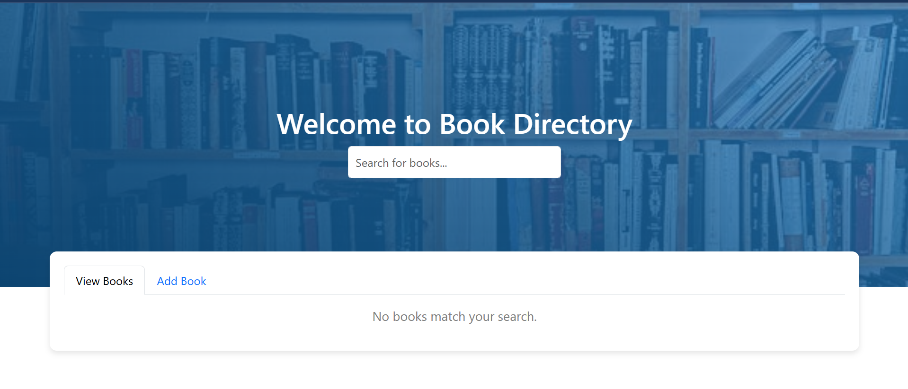
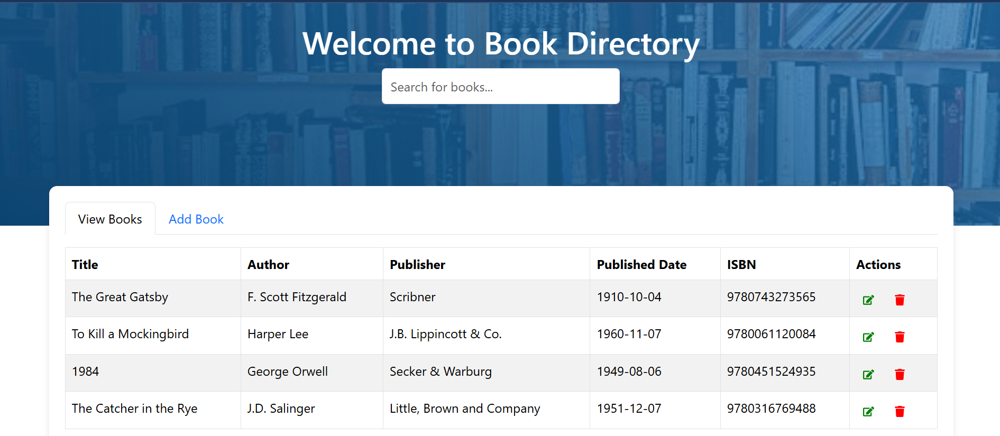

# Book Directory App

The **Book Directory App** is a simple React-based application that allows users to manage a collection of books. Users can add, edit, delete, and search for books. The app uses a JSON server as a mock backend for storing book data.

## Features

- **View Books**: Display a list of books in a table format.
- **Add Book**: Add a new book with details like title, author, publisher, published date, and ISBN.
- **Edit Book**: Update the details of an existing book.
- **Delete Book**: Remove a book from the directory.
- **Search Books**: Search for books by title, author, publisher, or ISBN.
- **Responsive Design**: Built using React Bootstrap for a clean and responsive UI.

---

## Technologies Used

- **Frontend**:
  - React.js
  - React Bootstrap (for UI components)
  - Axios (for API requests)
  - React Icons (for edit and delete icons)
  - React Toastify (for notifications)

- **Backend**:
  - JSON Server (mock backend)

---

## Setup Instructions

### Prerequisites

1. **Node.js**: Make sure you have Node.js installed on your machine. You can download it from [here](https://nodejs.org/).
2. **npm**: npm is included with Node.js.

### Steps to Run the App

1. **Clone the Repository**:
   ```bash
   git clone https://github.com/Portia-Nelly-Mashaba/Book-Directory-Nodejs.git
   cd book-directory-nodejs>
   ```

2. **Install Dependencies**:
   ```bash
   npm install
   ```

3. **Start the JSON Server**:
   - Navigate to the `backend` directory:
     ```bash
     cd backend
     ```
   - Install JSON Server (if not already installed):
     ```bash
     npm install -g json-server
     ```
   - Start the JSON Server:
     ```bash
     json-server --watch db.json --port 8080
     ```
   - The server will run at `http://localhost:5000`.

4. **Start the React App**:
   - Open a new terminal window and navigate to the project root directory:
     ```bash
     cd ..
     ```
   - Start the React development server:
     ```bash
     npm start
     ```
   - The app will open in your browser at `http://localhost:3000`.

---

## Usage

### View Books
- The home page displays a list of all books.
- Use the search bar to filter books by title, author, publisher, or ISBN.

### Add a Book
1. Click on the **"Add Book"** tab.
2. Fill in the form with the book details (title, author, publisher, published date, and ISBN).
3. Click **"Add Book"** to save the book.

### Edit a Book
1. Click the **edit icon** (✎) next to the book you want to edit.
2. Update the details in the modal form.
3. Click **"Update Book"** to save the changes.

### Delete a Book
- Click the **delete icon** (🗑️) next to the book you want to delete.
- A confirmation toast will appear, and the book will be removed from the list.

---

## Project Structure

```
book-directory-app/
├── public/                  # Static files
├── src/                     # React source code
│   ├── App.js               # Main application component
│   ├── index.js             # Entry point
│   ├── styles/              # CSS files (if any)
├── backend/                 # Backend files
│   ├── server.js            # JSON server setup
├── db.json                  # Mock database
├── package.json             # Node.js dependencies
├── README.md                # Project documentation
```

---

## API Endpoints

The app uses the following API endpoints provided by the JSON Server:

- **GET** `/books` - Fetch all books.
- **POST** `/books` - Add a new book.
- **PUT** `/books/:id` - Update a book by ID.
- **DELETE** `/books/:id` - Delete a book by ID.

---

## Screenshots

### Home Page


### Add Book Form


### View Book Page


### Edit Book Modal


---

## Contributing

Contributions are welcome! If you'd like to contribute to this project, please follow these steps:

1. Fork the repository.
2. Create a new branch for your feature or bugfix.
3. Commit your changes.
4. Push your changes to your fork.
5. Submit a pull request.

---


